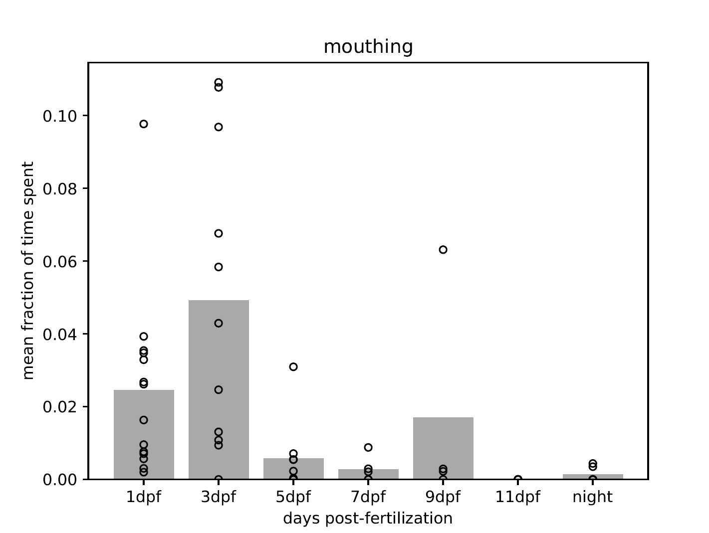

# Boris Analysis
The analysis pipeline for Boris annotations for mom and larvae.

---

Installation

After installing and activating the conda environment as described in the main repository's `README.md` file, you will need to download the Boris [behavioural annotation tool](https://www.boris.unito.it/).

---

Folder structure

In the `Boris` folder you should have the following folders:

- `data`
- `code`
- `plots`

---

Using Boris

 
Open the Boris program to start annotating the behaviours of your subjects. See Boris support documentation for more details. Described here is the process followed for this work:

In Boris, we created a **Boris project** for each day post-fertilisation we were measuring for the mom, and then separately for the babies, *e.g.* 1_dpf_moms.boris and 1_dpf_babies.boris

You can do multiple runs in these projects. We preferred to keep only the 'normal' runs in a project and did any abnormal runs (*e.g.* clutch swap moms) in a separate project.

Here is the table of behavioural annotations we used:

Once a run is finished:  
Go to the observation tab > Export events > Aggregated events.  
Save as `YYYYMM_xdpf_mom(babies)_agg.csv` in the `data` folder.

---

Analysis

Once you have all your CSV files in one folder, you can begin the analysis.  
This is roughly what the figures will look like:

Larvae analysis

No preprocessing of the `*_agg` files is necessary, as long as they are all in the `data` folder.  
There are two separate Python scripts depending on whether you would like to pool/stack 'resting' and 'head attached' as 'attached' or keep them separate.

Mother analysis

1. **Rename mothers**  
   This is important as in each annotation file, your mom is just called 'mom' and so when you concatenate all the datasets together, they will all be one individual.  
   You need to state which experiment type you are doing, *e.g.* 'normal_behaviour' or 'clutch_swaps'.

2. **Concat_by_dpf**  
   Now we need all our runs into one dataframe (df). First, make sure the old `All+xdpf_mother_agg.csv` files are deleted.

3. **mom_barchart**  
   Make sure you have the correct list of DPF that you want and that the experiment type is labeled. The run variable should be `All` unless you want to look at one specific mother's behaviours.

