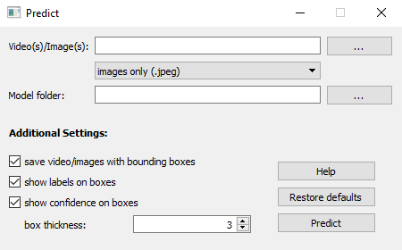

# InShell Analysis

---

<details>
<summary>Installation</summary>

Follow the instructions in the `README.md` file in the main repository to create and activate the environment `inShell` needed for the later stages of this analysis. The method in the YOLO-Gooey module is a pre-requisite for this data analysis pipeline. Make sure you have the corresponding `yolo_gooey` environment installed and activated when needed. 

</details>

---

<details>
<summary>Folder structure</summary>

Inside the folder `analysis`, create the following folders :

- `summary_data`
- `summary_plots`
- `YYYYMM` (folder name for each experimental run)

Inside each `YYYYMM` folder, you will need the subfolders:
  - `data`
  - `plots`

</details>

---

<details>
<summary>Extract images from video data</summary>

Navigate inside the `YOLO-Gooey` folder, activate the `yolo_gooey` environment, and run the following command:

```
python frames_from_videos.py -d path/to/folder_with_vids/
```
This step has to be done for each run.
</details>

---

<details>
<summary>YOLO Object detection</summary>

Still inside the `YOLO-Gooey` folder, run the following command:
```
python start.py
```

Choose **predict** and you should see this window:



1. In **Video(s)/image(s)**, navigate (back one) > from_argos > argos > argos_out > YYYMMDD_HHMMSS > camX.
2. Select the 'images only (.JPEG\*)' option.
3. In **Model folder**, navigate to `output_train > _find your model_.
4. Check boxes according to your needs (suggestions provided above).

Click **Predict** (the process takes ~5 min).

Once complete, follow these steps:
- Navigate to `YOLO-Gooey/output_predict/YYYYMM/camX/Results#/labels`
- Copy `camX.csv`
- Paste the CSV inside `./analysis/YYYYMM/data`
- Rename it to `YYYYMM.csv`

</details>

---

<details>
<summary>Draw ROIs for larvae and mom</summary>

First, follow these steps:
- From the extracted frames, choose a single frame to use for labelling regions of interest (provided the FOV does not move during your experiment).
- Copy and paste it in `./analysis/YYYYMM/data`.
- Rename it to `YYYYMM_reference_frame.JPEG`.

Return to this folder (`InShell`), activate the `inShell` environment, and run the following command:
```
labelme
```

This command deploys an external annotation GUI. Inside the GUI, open the directory `./analysis/YYYYMM/data` and choose any image file. Declare the chamber names as 'entrance', 'laying', 'deep' and make the demarcations as similar to previous runs as possible.

Do this for larvae and save as `YYYYMM.json` in `./analysis/YYYYMM/data`.

Repeat the process for mom and save as `YYYYMM_mom.json` in `./analysis/YYYYMM/data`.

**Note:** The entrance chamber extends a little further into the laying chamber for the mom's ROIs, as her face center point sits in the laying chamber even though behaviourly this is what I would call entrance (just sitting in the shell), and when she is really in the laying chamber she likely engages with the offspring.

</details>

---

<details>
<summary>Data analysis pipeline for Larvae</summary>
<br>
Work through the notebooks in the code folder. These notebook files are numbered, but here are some pointers for each workbook:

- In `plotting_utils.py`, you need to make sure the code reads the colors for larvae (blues), while the mom colour definitions are commented.

### 1. Data-processing
- Change the run name `YYYYMM`.
- Enter the YOLO model name that you trained.
- Copy the name of the created CSV file at the end of running the notebook.

### 2.1. Larvae analysis OR 2.clutch swap
- Paste the CSV file name (~ YYYYMM_model#_processed_*date*) from Data-processing and change the run name `YYYYMM`. Change the model name if necessary.
- Choose between:
  - **Extract ROI column (single dfs)**: In the normal case.
  - **Extract ROI column (split dfs)**: When you need to split the dataframe into multiple sections (*e.g.* if the camera moves and you have two reference pictures on the shell).

- In larvae numbers, note down emergence, enter_laying, and enter deep for each run. We stored them each in a separate CSV file called `em_summary`, `ent_lay_summary`, and `ent_deep_summary` stored in `data_summary`, and added when we ran each run through the analysis.

  - Calculate times as decimals (e.g., `9 dpf 11:51 -> 9.49`).
  - Use the format `DPF.HourAsDecimal` in the spreadsheet.


### 3: Summary_chamberplots and Summary_chamberplots_anova
- You can run these notebooks as they are, if you have named everything as we did.
- The **Summary_chamberplots** gives you the summary figure of the three larvae transitions for each of the different conditions (control, momectomy, *etc*).
- The **Summary_chamberplots_anova** allows you to calculate statistics and draws box plots separately for each transition, but again across all conditions.

</details>

---

<details>
<summary>Data analysis pipeline for Mom</summary>
<br>

In `plotting_utils.py`, you need to make sure the code reads the colors for mom (reds), and the larvae colour definitions are commented.

### 1. Data processing
- You can skip this step if you have already done it for the larvae. Otherwise, refer to the first step in the instructions for Data analysis pipeline for Larvae.

### 2. Mom YOLO
- Paste the CSV file name (~ YYYYMM_model#_processed_*date*) from Data-processing and change the run name `YYYYMM`. Change the model name if necessary.
- Choose between:
  - **Extract ROI column (single dfs)**: In the normal case.
  - **Extract ROI column (split dfs)**: When you need to split the dataframe into multiple sections (*e.g.* if the camera moves and you have two reference pictures on the shell).

- Can generally ignore finding night and day times section.
- **Visitation frequency plot**:
  - From visitation counts for day and night, determine if any information or days are missing.
  - Edit the # list in "insert 0 in missing days to run the code for the specific dpf that are missing... you should have equal days and nights.

### 3: Cumulative Visitations
Add the days you wish to include in the mom's visitations to the dictionary variable, *e.g.* `'YYYYMM': [1,2,3,4...]`

Then run everything until the next markdown instruction: "Now go change the table: Delete all 0 dpf."

Follow the steps to adjust and save the `Summary_visitation_adapted.csv` file.

To generate the plots, choose between running the day and the night plot by adjusting the # comment at the top of the plotting cell.

### Step 5: Summary chamber plots

- Add each run's times to the Excel spreadsheet in the `Inshell experiments used in analysis` file.
- Calculate times as decimals (*e.g.* `9 dpf 11:51 -> 9.49`).
- Use the format `DPF.HourAsDecimal` in the spreadsheet.

</details>