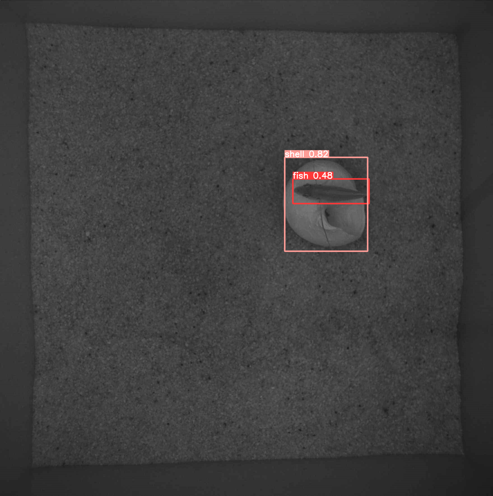
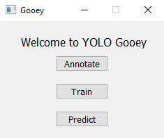
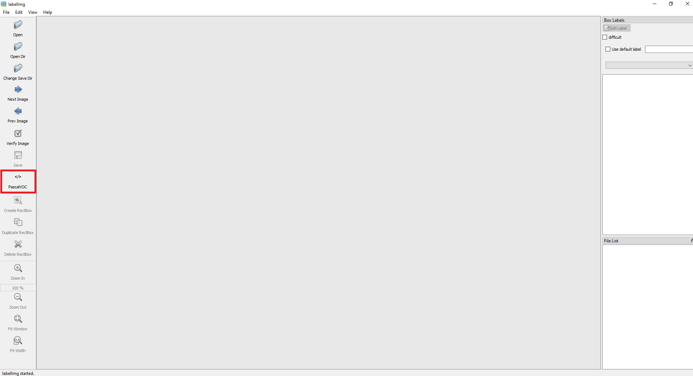
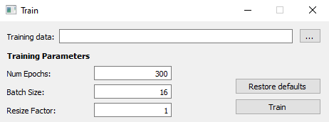
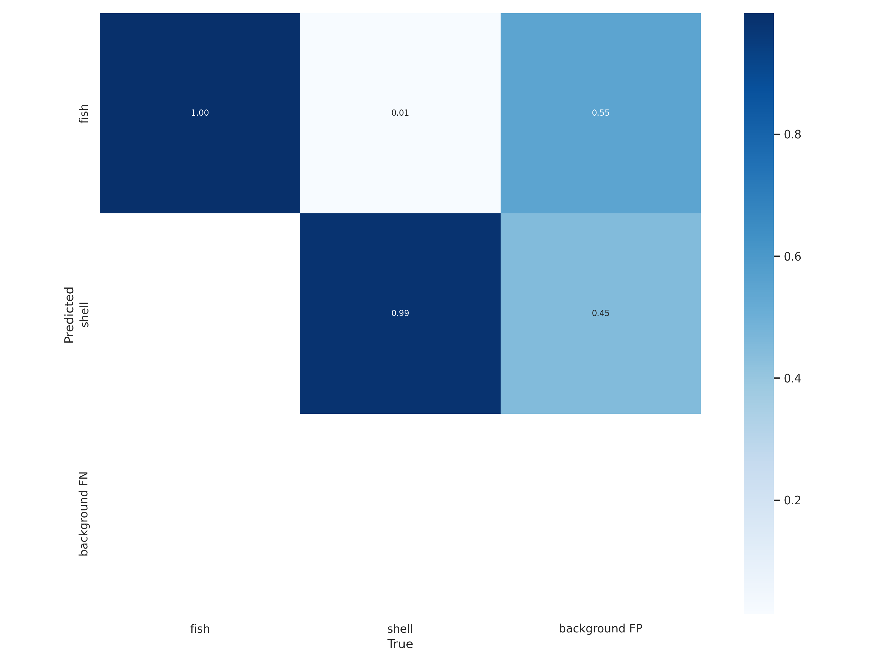
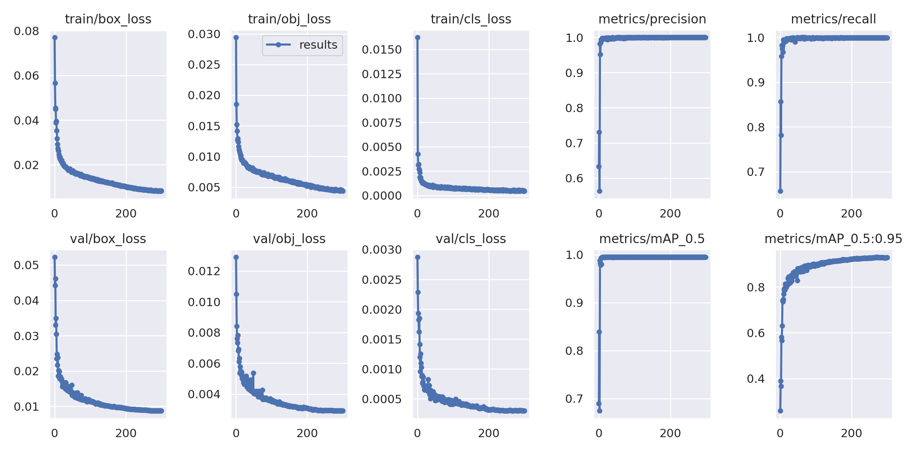
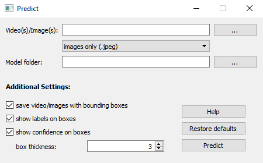

## YOLO Gooey
A GUI for object detection using [YOLOv5](https://github.com/ultralytics/yolov5).

<br>
<p align="center">

</p>

---

<details>
<summary>Installation</summary>

Follow the instructions in the `README.md` file in the main repository to create and activate the environment `yolo_gooey` needed for this GUI and underlying method. 

</details>

---

<details>
<summary>Quick Start</summary>

To launch the application, run the command:
```
python start.py
```
The welcoming page will look like this:
<br>
<p align="center">

</p>
<br>

<details>
<summary>Annotate</summary>

Training an object detector requires a training dataset containing images and their set of object bounding boxes. Each bounding box is a rectangle enclosing a single object of a specific class. To construct this dataset, we suggest using the annotation software [labelImg](https://github.com/tzutalin/labelImg), which allows you to easily open a folder with images and draw object bounding boxes for each image.

The interface of this program looks like this:
<br>
<p align="center">

</p>

To annotate, follow these steps:
<ol>
<li>
Click on <b><u>Open Dir</u></b> to open your folder of images you wish to label.
</li>
<br>
<li>
Set the format to <b><u>PascalVOC</u></b> (default) ⚠️. This code only supports annotations saved in the PascalVOC format.
</li>
<br>
<li>
Click on <b><u>Create RectBox</u></b>. Then, click & drag your cursor to label the different objects in the image.
</li>
<br>
<li>
Click on <b><u>Save</u></b> to save your annotations.
</li>
<br>
<li>
Click on <b><u>Next Image</u></b> (or <kbd>D</kbd> key) to label another image.

<br>
If you want to correct a previously annotated image, click on <b><u>Prev Image</u></b> (or <kbd>A</kbd> key) and scale/move/add/remove bouding boxes. <i>Make sure you save the new annotations to overwrite the old annotations.</i>
</li>
</ol>

</details>
<br>
<details>
<summary>Train</summary>

After annotating your images, you are ready to use them during detection model training. Make sure to run this training stage on a machine with a GPU. Models can also be trained on CPU, but the training process is substantially slower.

The training interface looks like this:
<br>
<p align="center">

</p>

To initiate model training, follow these steps:
<ol>
<li>
Browse to your <b><u>training data folder</u></b>.
<br>
<small>The training data folder needs to contain at least 10 images and their corresponding PascalVOC .xml annotations with the same name.</small>
</li>
<br>
<li>
Choose the <b><u>number of epochs</u></b>.
<br>
<small>1 epoch = 1 iteration through the entire dataset.</small>
</li>
<br>
<li>
Choose the <b><u>batch size</u></b>.
<br>
<small>Usually set as a power of 2 (<i>i.e.</i> 2, 4, 8, 16, ...). A larger batch size implies greater memory consumption, but will aid the network in generalizing to unseen data.</small>
</li>
<br>
<li>
Choose your <b><u>resize factor</u></b> from <b>(0.0, 1.0]</b>.
<br>
<small>The resize factor determines the shape of the training images before going through the network. A small resize factor might lead to downsampling-upsampling issues where bounding box centers appear to lie on a grid of points. On the other hand, a larger resize factor implies greater memory consumption, but will help the network learn smaller features, such as edges or small characteristic texture patches, to yield more accurate results.</small>
</li>
<br>
<li>
Click on <b><u>Train</u></b>.
</li>

<br>
After you've successfully trained your model, it can be found under:
<br>
<u><i>output_train/&lttraining_dataset&gt/model&ltnum&gt</i></u>
<br>
The folder contains the model weights as well as additional plots that show the networks prediction accuracy, as shown here:
<p align="center">


</p>
</ol>

</details>
<br>
<details>
<summary>Predict</summary>
After successfully training a model, we want to use it to predict bounding boxes on unseen video(s)/image(s). To do so, select the <b>Predict</b> option on the welcoming page, which will guide you to the following page:

<br>
<p align="center">

</p>

To perfom prediction, follow these steps:
<ol>
<li>
Browse to your <b><u>video(s)/image(s)</u></b>.
<br>
<small>You can select a single image/single video/folder of images and/or videos. In case you select a folder of images/videos, use the drop-down menu to choose to run the prediction run on all images in the folder/all videos in the folder/all videos AND images in the folder.</small>
</li>
<br>
<li>
Choose a <b><u>trained model</u></b>.
<br>
<small>The folder can be found under <i>output_train/&lttraining_dataset&gt/model&ltnum&gt</i>. It contains the model weights and training configuration.</small>
</li>
<br>
<li>
Choose whether the video/image(s) should be saved with <b><u>overlayed bounding boxes</u></b>. You can also set additional bounding box styling options.
</li>
<br>
<li>
Click on <b><u>Predict</u></b>.
</li>
<br>
For a more detailed explanation of the different fields, click on the <b><u>Help</u></b> button.
<br>
<br>
After performing prediction, the results will be saved under:
<br>
<u><i>output_predict/&ltprediction_dataset&gt/result&ltnum&gt</i></u>
<br>
The result folder will contain the overlayed bounding boxes and a CSV file containing the detected bounding boxes (found under the <i>labels</i> subfolder). <b>Keep in mind that the CSV file contains normalized bounding box coordinates and dimensions.</b>

</ol>
</details>
</ol>
</details>

---

<details>
<summary>Prediction Improvements</summary>

Some images might be harder to work with than others. Here are some ideas to help improve your network's predictions:

<ol>
<li><u>Increase your epoch number</u> to 600 or even 1200. However, be careful not to overtrain your network. With a very large epoch number, your model might overfit the training data. If you see that the validation loss is low and stays constant (close to 0) for a long time, you should <u>consider decreasing your epoch number</u>.</li>
<li>Make sure your <u>batch size is not very small</u>. You may also want to <u>set the resize factor to 1</u> so that small image features are not washed away by downscaling the images.</li>
<li><u>Apply data augmentation</u>. This process adds variance to your training dataset by including images where the objects of interest have different poses, brightness, colors, blurriness, <i>etc.</i> To do this, run the data augmentation script over a folder of PascalVOC-annotated images, as shown below. <b>The resulting augmented annotations are added to the SAME FOLDER</b>. Note that you can always enable/disable specific augmentations (see data_augmentation/augmentor_utils.py):


    python data_augmentation/augmentor.py -d <path_to_data_folder>
</li>
<li>For your post-detection analysis script/pipeline, we suggest thresholding predictions by confidence to filter out low-confidence bounding boxes.</li>
</ol>
</details>

---

<details>
<summary>Extra</summary>
This program acts as a GUI on top of the pre-existing YOLOv5 package. Should a newer version of YOLO be released, the current package version can be swapped out for the newer version without much code change.

<br>
<p align="center">

</p>

To adapt the original YOLOv5 package to this use, the following changes were made to the source code:
<ol>
<li>
  <u>yolov5/detect.py</u>: When performing video prediction, the original package would output a .txt file for every frame of the video. This was changed so that all the frame predictions would be output to a single .txt file.
</li>
</ol>

At code level, all changes were marked with a '### CHANGES ###' comment in the source code.

</details>
